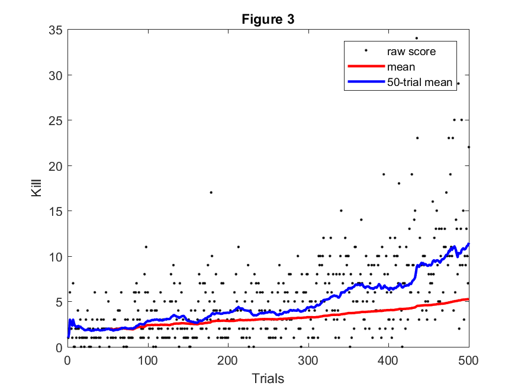
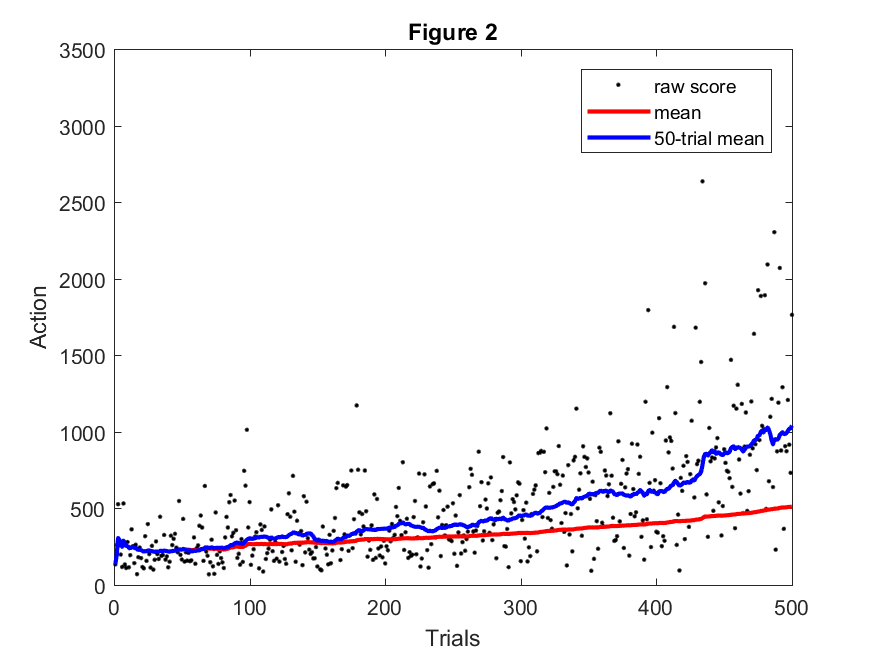

## Video
<!--- Video: Use a level two header to at the very top, and embed the video of your project. In order to embed
the video, find your YouTube video ID, and insert the following in final.md after the header:
[]
(https://www.youtube.com/watch?v=YOUTUBE_VIDEO_ID_HERE)
As in the status report, the video should contain a brief problem description (using images, screenshots,
or screen captures), an example capture of how a simple baseline performs, and an example capture of
a run that is your best. You are free to include more details, such as summary of how you did it, some of
the failure cases, but it is not needed. The video should be a maximum of three minutes (less is fine), of
reasonably high quality, i.e. a minimum resolution of 1200 × 720 (i.e. 720p), and speech, if any, should be
comprehensible. --->

## Project Summary
<!--- Project Summary: Use another level-two header to start a Project Summary section. Write a few paragraphs
summarizing the goals of the project (yes, yet again, but updated/improved version from the status). In
particular, make sure that the problem is clearly defined here, and feel free to use an image or so to set up
the task. Part of the evaluation will be on how well you are able to motivate the challenges of the problem,
i.e. why is it not trivial, and why you need AI/ML algorithms to solve it. --->

The goal of Project Gladiator is to create an agent capable of fighting zombies in Minecraft. For a human player, this does not seem like a daunting task. "Grab your sword and start swinging" as my friend once stated, but teaching a computer to do this is entirely different. Taking the approach of my friend, an agent could use a shortest path algorithm with continuous sword swinging. This would result in a swift death, a player has a general idea of when to stop attacking and run away. No consideration is put into how to survive against the zombie swinging back. This becomes a challenge for the agent.

Considering the aforementioned methods of combat, we chose to use SARSA (State Action Reward State Action) algorithm with epsilon-greedy action selection for a Markov Decision Process.  A simple agent which acts randomly or simply moves toward the zombie swinging its sword performs extremely poorly and rarely kills even a single zombie. The game world can be broken down into a series of episodes with information based on the current state similar to how a player would evaluate the situation. Agent health, the distance of the zombie, nearby obstructions, and whether the agent or zombie have been hit are all considered. The agent then decides if an attack should be attempted or if moving is more viable. From a top-down view of the SARSA algorithm and the player, they will be doing identical things, with the exception that a human player has intuition. The agent, well he has his Q table.

With sword and Q table in hand, we sent our gladiator into combat with zombies to find out if he is capable of learning to fight.

## Approaches
<!--- Approaches: Use another level-two header called Approaches, In this section, describe both the baselines
and your proposed approach(es). Describe precisely what the advantages and disadvantages of each are,
for example, why one might be more accurate, need less data, take more time, overfit, and so on. Include
enough technical information to be able to (mostly) reproduce your project, in particular, use pseudocode
and equations as much as possible. --->

Our initial approach automatically made the agent continuously swing its sword, which allowed us to simplify the state space and actions for the agent. The agent was only responsible for moving in the Minecraft arena. For this, we chose to use discrete movement. Later, our approach changed and we switched to continuous movement and required the agent to learn to swing his sword. This provided more interesting interactions with zombies as well as noticeable improvement to the policy over the duration of subsequent rounds, as explained later.

### Algorithm
The SARSA algorithm works by looking at the current state, choosing an action, and looking at the resulting state/action pair to incorporate potential future rewards as part of the reward for the current one. The algorithm behaves as follows:

    for each trial
        initialize state s
        action a = epsilon-greedy(s, actions)
        while state is not terminal:    
            take action a
            observe new state s_prime
            calculate reward r
            action a_prime = epsilon-greedy(s_prime, actions)
            q_table[s,a] += alpha * (r + (gamma * q_table[s_prime,a_prime]) - q_table[s,a])
            s = s_prime
            a = a_prime

The epsilon-greedy algorithm for choosing an action is as follows:

    epsilon-greedy(state, actions)
        if random_number < epsilon
            return random action from actions
        else
            return random action from all q_table[state,a] with max value

### Discrete Movement

During the discrete movement approach, our agent was simple. He was only able to move north, south, east, and west or stand still as shown in the image. Trying to simplify the state space to this degree caused some unforeseen issues. The agent would get cornered easily while backing up which gave the zombie an advantage. Discrete movement also had issues if the agent got knocked away from the center of block.  If this occurred, the agent would attempt to move but the command would no longer execute. When the agent moved, it would only move in the two directions directly away from the zombie which lead it into a corner because the zombie was moving with continuous movement and would essentially control the agents direction. If the agent was not directly under attack, it would "bounce" around on the movement grid while figuring how to get to the zombie. It did not seem realistic for a human player and we moved away from this method.

### Continuous Movement

The improvement for the discrete movement was continuous movement. Although the agent still moves in discrete increments to simplify the state space, it can do so at any angle and moves forward, back, left or right, relative to the enemy. The agent was no longer bound to the grid of blocks within the Minecraft world and could move openly. With this change, we also moved sword swinging to be included as an agents action rather than an automatic one. The result was a more human looking combat and was less erratic.

### State Space and Actions
The state space went through many versions during the project. Determining what to include and exclude from the state space became vital to the agent's ability to understand the world around it. Initial attempts tracked the unobstructed blocks around the agent and the location of the zombie relative to the agent. The actions for this state were discrete movement with automatic attacking and automatic orientation of the agent's view toward the zombie. Subsequent versions added and removed parameters to the state space and actions, before settling on the final set.

The final form of the state space was more complex than any of the previous versions. We tracked the health of the agent in brackets of 25%. We tracked which blocks adjacent to the agent were air blocks and which were obstructed. We also tracked whether the agent or enemy landed a hit. The distance to the zombie from the agent was represented as the Euclidian distance. The agent's available actions were move forward or backward, strafe left or right, or attack. We removed the option to do nothing because there is a possible action that will always give a better reward than do nothing and was obsolete. To simplify the problem, we kept automatic orientation of the agent's view toward the enemy and did not reach the point that this was left up to the agent.

### Rewards
The reward system influences the behavior of the agent. We wanted the agent to both aggress against an enemy and take action to survive as long as possible. The reward system went through many variations during the project. At first, the agent wasn't incentivized enough to seek out zombies. It was content with wandering around until a zombie threatened it. The latest version gives the agent a reward to staying alive but a greater reward for seeking out an enemy. Attacking a zombie with the sword (agent's only method for damaging the enemy) gives the greatest reward if it lands a hit. The agent is also penalized if it receives damage from the zombie.  Survivability is incentivized in two ways: the fist is by giving a small, flat reward every time the agent survives a state. The second, which actually manifested as a shift an aggressiveness based on relative health of the agent, deducts a penalty from the agent's reward that scales up as its health lowers. At full health there is no penalty for taking a hit, and below 25% health the full penalty is deducted.  To promote attacking the zombie, the agent is rewarded for moving toward the zombie and penalized for moving away. It also receives a large reward for dealing damage to the zombie. To discourage the agent from attempting to move into an obstructed block, a small flat penalty is applied if this is attempted.

* PROXIMITY_REWARD = 30
* ENEMY_HIT_REWARD = 30
* DAMAGE_REWARD = -ENEMY_HIT_REWARD / HEALTH_THRESHOLDS[-1][1] #scale penalty based on relative health
* WALL_REWARD = -10
* TICK_REWARD = 5

## Evaluation
<!--- Evaluation: An important aspect of your project, as I’ve mentioned several times now, is evaluating your
project. Be clear and precise about describing the evaluation setup, for both quantitative and qualitative
results. Present the results to convince the reader that you have solved the problem, to whatever extent you
claim you have. Use plots, charts, tables, screenshots, figures, etc. as needed. I expect you will need at least
a few paragraphs to describe each type of evaluation that you perform. --->

To evaluate the agent's ability to fight zombies, we broke the analysis into three parts; Kills, Actions, and Cumulative Reward. As the agent performed rounds of combat (a round is defined as the point from spawning in until death of agent), statistical data was gathered on the number of slain zombies and the actions performed by the agent on a per round basis. The data was written to a file and imported to MATLAB for analysis.  Due to the nature of combat and the imprecise representation of the game world by our state space, certain situations in combat cause significant issues for the agent, particularly when the zombie can repeatedly knock the agent against the wall. We were not able to accurately model this situation and, as such, the data obtained had some significant amount of noise when this occurred.

### Kills
Kills compares the number of zombie kills of sequential rounds. The higher the number of kills, the greater the lethality of the agent. If our agent is effectively learning a policy, we expect to see a steady increase in the number of kills per round. Initially, we wanted to grant merit based on efficient killing, but moving to zombies quickly and killing many zombies conflicted and the agent performed quite poorly and could not learn an effective policy.

Figure 1 shows the tracked kills over the course of 500 rounds. After plotting the data, an overall mean and a moving mean tracked over the most recent 50 trials are both plotted. This shows that the agent was clearly improving at a consistent rate over the untrained model.

### Actions
Actions compares the number of actions made by the agent for a given round, which directly corresponds to agent lifetime. The higher the number of actions, the longer the agent was able to survive. Each time the SARSA algorithm produces an action to be carried out by the agent, the action count is incremented.

Figure 2 shows the tracked actions over the course of 500 rounds. As with the data for kills, we plotted the data and applied an overall and a shifting mean. The agent is surviving longer as the rounds progress. The agent was lasting for approximately 250 actions during the beginning of the trails and approximately one thousand actions during the latter portion, sometimes as high as several thousand.

### Cumulative Reward
Cumulative rewards indicates total amount of rewards received during a given round. This allows us to evaluate whether our model and reward system actually encourage the agent to maximize rewards. Figure 4 alone is not an indicator of how well the agent is progressing because this is a measure of how well it is able to get rewards based on how we have set their values. It does give insight when compared to zombie kills and/or actions.

### Analysis
Evaluating the three figures above gives insight into the behavior of the agent. As can be seen, the mean rewards, kills, and actions have a similar shape which is consistently trending upward. This suggests that not only did our agent learn to increase its reward effectively, this directly translated to increased lifetime and increased total zombie kills as intended. The agent is making noticeable improvement to its policy for combating zombies. The agent is surviving for longer periods of time as shown in the increase in figure 2. During this longer survival time, the agent is also able to acquire more zombies kills based on the increase in figure 1. This shows that the agent is effectively balancing survival with kills.

## References
<!--- References: Make a list of work you’re citing in your description above (starting with a level-two header).
This should include any papers you think are relevant, third-party source code you used, sources for any of
the images that you didn’t create, and any other websites/links you found useful. --->
* Zombie and Agent graphic [http://minecraft.gamepedia.com](http://minecraft.gamepedia.com)
* SARSA psuedocode [http://www.cse.unsw.edu.au/~cs9417ml/RL1/algorithms.html](http://www.cse.unsw.edu.au/~cs9417ml/RL1/algorithms.html)
* SARSA research [https://en.wikipedia.org/wiki/State-Action-Reward-State-Action](https://en.wikipedia.org/wiki/State-Action-Reward-State-Action)
* SARSA research [http://artint.info/html/ArtInt_268.html](http://artint.info/html/ArtInt_268.html)
* Deep Learning, Epislon-Greedy, Statespace [http://cs229.stanford.edu/proj2016/report/UdagawaLeeNarasimhan-FightingZombiesInMinecraftWithDeepReinforcementLearning-report.pdf](http://cs229.stanford.edu/proj2016/report/UdagawaLeeNarasimhan-FightingZombiesInMinecraftWithDeepReinforcementLearning-report.pdf)
* Project Malmo API [http://microsoft.github.io/malmo/0.21.0/Documentation/index.html](http://microsoft.github.io/malmo/0.21.0/Documentation/index.html)
