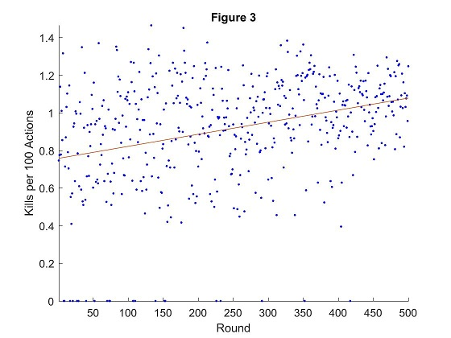

## Video
<!--- Video: Use a level two header to at the very top, and embed the video of your project. In order to embed
the video, find your YouTube video ID, and insert the following in final.md after the header:
[]
(https://www.youtube.com/watch?v=YOUTUBE_VIDEO_ID_HERE)
As in the status report, the video should contain a brief problem description (using images, screenshots,
or screen captures), an example capture of how a simple baseline performs, and an example capture of
a run that is your best. You are free to include more details, such as summary of how you did it, some of
the failure cases, but it is not needed. The video should be a maximum of three minutes (less is fine), of
reasonably high quality, i.e. a minimum resolution of 1200 × 720 (i.e. 720p), and speech, if any, should be
comprehensible. --->

<!--- placeholder until I upload final video --->

## Project Summary
<!--- Project Summary: Use another level-two header to start a Project Summary section. Write a few paragraphs
summarizing the goals of the project (yes, yet again, but updated/improved version from the status). In
particular, make sure that the problem is clearly defined here, and feel free to use an image or so to set up
the task. Part of the evaluation will be on how well you are able to motivate the challenges of the problem,
i.e. why is it not trivial, and why you need AI/ML algorithms to solve it. --->

The goal of Project Gladiator is to create an agent capable of fighting zombies in minecraft. For a human player, this does not seem like a daunting task. "Grab your sword and start swinging" as my friend once stated, but teaching a computer to do this is entirely different. Taking the approach of my friend, an agent could use a shortest path algorithm with continuous sword swinging. This would result in a swift death, a player has a general idea of when to stop attacking and run away. No consideration is put into how to survive against the zombie swinging back. This becomes a challenge for the agent.

Considering the afformentioned methods of combat, we choose to use SARSA (State Action Reward State Action) algorithm for a Markov Decision Process. The game world can be broken down into a series of episodes with information based on the current state similar to how a player would evaluate the situation. Consideration is put into the players health, the distance of the zombie, etc. The player then decides if an attack should be attempted or if backing away is more viable. From a top-down view of the sarsa algorithm and the player, they will be doing indentical things, with the exception that a human player has intuition. The agent, well he has his q_table.

With sword and q_table in hand, we sent our gladitor into combat with zombies to find out if he is capable of learning to fight.

## Approaches
<!--- Approaches: Use another level-two header called Approaches, In this section, describe both the baselines
and your proposed approach(es). Describe precisely what the advantages and disadvantages of each are,
for example, why one might be more accurate, need less data, take more time, overfit, and so on. Include
enough technical information to be able to (mostly) reproduce your project, in particular, use pseudocode
and equations as much as possible. --->

We started our approach by having the agent continously swing his sword, which allowed us to simplify the statespace and actions for the agent. The agent was only responsible for moving in the minecraft arena. For this, we chose to use finite movement. Later, our approach changed and we switched to continuous movement and required the agent to learn to swing his sword. This provided more interesting interactions with zombies as well as noticable improvement to the policy over the duration of subsequent rounds, as explained later.

### Finite Movement

During the finite movement approach, our agent was simple. He was only able to move north, south, east, and west or stand still as shown in the image. Trying to simplify the statespace to this degree caused some unforseen issues for us. The agent would get cornered easily while backing up which gave the zombie an advantage. The agent would only move in the two directions directly away from the zombie which lead it into a corner because the zombie was moving with continuous movement and would essentially control the agents direction. If the agent was not directly under attack, it would "bounce" around on the movement grid while figuring how to get to the zombie. It did not seem realistic for a human player and we moved away from this method.

### Continuous Movement

The improvement for the finite movement was continuous movement. The agent was no longer bound to the grid of blocks within the minecraft world and could move openly. The agent has the choice to stand still, move forward, move backwards, or strafe left and right. During this implementation, we added sword swinging to the agents actions. The result was a more human looking combat and was less erratic. 

### Statespace and Actions
The statespace went through many versions during the project. Determinging what to include and exclude from the statespace became vital to the agent's ability to understand the world around it. Initial attempts tracked the blocks around the agent and the approximate location of the zombie. The actions for this state were finite movement with auto attacks. Subsequent versions added and subtracted to the statespace and actions. Blocks were removed in favor of distance tracking using the difference between agent and zombie on the x and z axis, and attacks were added to actions in favor of auto attacking. 

The final form of the statespace was far larger than any of the previous versions. We tracked the health of the agent in brackets of 20% health. Air blocks were added to give a penalty to the agent for moving into a wall. If the agent or mob landed a hit, it was noted in the statespace. The distance to the zombie from the agent was tracked by euclidian distance. The agent's movement was forward and backswards, strafe, and attack. We removed the option to do nothing because there is a possible action that will always give a better reward than do nothing and was obsolete.

### Rewards
The reward system dictates the behavior of the agent. We wanted the agent to be aggressive while being defensive simultaneously. The reward system went thru many variations during the project. At first, the agent wasn't incentivised enough to seek out zombies. It was content with wondering around until a zombie threatented it. The latest version gives the agent a reward to staying alive but a greater reward for seeking out an enemy. Attacking a zombie with the sword (agent's only method for damaging the enemy) gives the greatest reward. Survivability uses an equation to calculate the reward because based on the agent's health, attacking an enemy would be better with high health than backing away. The tick reward also influences the survivability of the agent for subsequent trials. Backing away is better if at low health when taking a hit from a zombie. Moving into a wall is penalized because the agent can not enter the wall. The agent was not penalized for death in our model because the agent only had one life to live.

* PROXIMITY_REWARD = 10
* ENEMY_HIT_REWARD = 30
* DAMAGE_REWARD = -ENEMY_HIT_REWARD / HEALTH_THRESHOLDS[-1][1] #scale penalty based on relative health
* WALL_REWARD = -10
* TICK_REWARD = 5

## Evaluation
<!--- Evaluation: An important aspect of your project, as I’ve mentioned several times now, is evaluating your
project. Be clear and precise about describing the evaluation setup, for both quantitative and qualitative
results. Present the results to convince the reader that you have solved the problem, to whatever extent you
claim you have. Use plots, charts, tables, screenshots, figures, etc. as needed. I expect you will need at least
a few paragraphs to describe each type of evaluation that you perform. --->

To evaluate the agent's ability to fight zombies, we broke the analysis into three parts; Kills, Actions, and Kills per Action. As the agent performed rounds of combat (a round is defined as the point from spawning in until death of agent), statistical data was gathered on the number of slain zombies and the actions performed by the agent on a per round basis. The data was written to a file and imported to Matlab for analysis.

### Kills
Kills compares the number of zombie kills of sequential rounds. The higher the number of kills, the greater the long term leathality of the agent. This does not equate to effectiveness because the time of a round is based on how long the agent survived. Two cases for example are the agent quickly killed zombies and died, or ran around and did not kill many zombies. 

Figure 1 shows the tracked kills over the course of 500 rounds. Due to the complexity of combat, the outcomes can vary drastically between rounds. After plotting the data, a 1 degree polynomial best fit algorithm is used and graphed. As the figure indicates, the agent is able to attain more kills as the rounds progressed.

### Actions
Actions compares the number of actions made by the agent for a given round. The higher the number of actions, the longer the agent was able to survive. This does not display the leathality of the agent. The agent could be moving around or away from zombies the entire round. Each itteration of the SARSA algorithm produces an action carried out by the agent; move, attack, do nothing.

Figure 2 shows the tracked actions over the course of 500 rounds. As with the data for kills, we plotted the data and applied a best fit graph. The agent is surviving longer as the rounds progress. The agent was lasting for approximately 250 actions during the beginning of the trails and approximately 750 actions during the latter portion. During the course of the learning, the agent is able to survive three times longer than when it started.

### KPA (Kills Per Action)
Taking the previous two evaluations into consideration, produces the primary evaluation of the agent. KPA is the kills per action of the agent. The KPA value is an indicator of how effective is the agent at balancing survivability with leathality. A low KPA value is due to ineffective use of actions while a high KPA value is the result of using more actions which assist in slaying zombies. The basis for this, is an effective player will get the highest value for the least investment (moves). The following image is based on Kills per 100 Actions to make the image easier to visualize. 

### Analysis
Evaluating the three afformentioned graphs above, gives insight into the behavior of the agent. The agent is making noticeable improvement to its policy for combating zombies. The agent is surviving for longer periods of time as shown in the increase in figure 2. During this longer suvival time, the agent is also able to acquire more zombies kills based on the increase in figure 1. Figure 3 indicates the agent is effectively balancing survival with kills.

Based on the data collected, the agent during the initial 100 rounds has an effectivness of about 0.8% or 1 kill per 125 moves. As the agent continues to learn, the agent has an effectivness of about 1% during the last 100 rounds or 1 kill per 100 moves. The agent improved its ability to acquire kills by 25% or alternatively, reduced inefficient moves by 20%.

## References
<!--- References: Make a list of work you’re citing in your description above (starting with a level-two header).
This should include any papers you think are relevant, third-party source code you used, sources for any of
the images that you didn’t create, and any other websites/links you found useful. --->
* Zombie and Agent graphic http://minecraft.gamepedia.com
* SARSA psuecode http://www.cse.unsw.edu.au/~cs9417ml/RL1/algorithms.html
* SARSA research https://en.wikipedia.org/wiki/State-Action-Reward-State-Action
* SARSA research http://artint.info/html/ArtInt_268.html
* Deep Learning, Epislon-Greedy, Statespace http://cs229.stanford.edu/proj2016/report/UdagawaLeeNarasimhan-FightingZombiesInMinecraftWithDeepReinforcementLearning-report.pdf 
* Project Malmo API http://microsoft.github.io/malmo/0.21.0/Documentation/index.html
