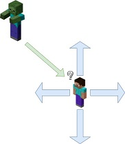
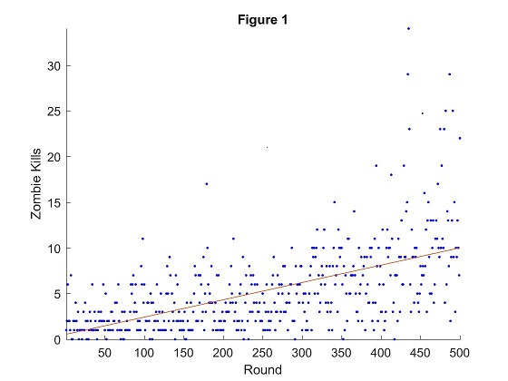

## Video
<!--- Video: Use a level two header to at the very top, and embed the video of your project. In order to embed
the video, find your YouTube video ID, and insert the following in final.md after the header:
[]
(https://www.youtube.com/watch?v=YOUTUBE_VIDEO_ID_HERE)
As in the status report, the video should contain a brief problem description (using images, screenshots,
or screen captures), an example capture of how a simple baseline performs, and an example capture of
a run that is your best. You are free to include more details, such as summary of how you did it, some of
the failure cases, but it is not needed. The video should be a maximum of three minutes (less is fine), of
reasonably high quality, i.e. a minimum resolution of 1200 × 720 (i.e. 720p), and speech, if any, should be
comprehensible. --->

<!--- placeholder until I upload final video --->

## Project Summary
<!--- Project Summary: Use another level-two header to start a Project Summary section. Write a few paragraphs
summarizing the goals of the project (yes, yet again, but updated/improved version from the status). In
particular, make sure that the problem is clearly defined here, and feel free to use an image or so to set up
the task. Part of the evaluation will be on how well you are able to motivate the challenges of the problem,
i.e. why is it not trivial, and why you need AI/ML algorithms to solve it. --->

## Approaches
<!--- Approaches: Use another level-two header called Approaches, In this section, describe both the baselines
and your proposed approach(es). Describe precisely what the advantages and disadvantages of each are,
for example, why one might be more accurate, need less data, take more time, overfit, and so on. Include
enough technical information to be able to (mostly) reproduce your project, in particular, use pseudocode
and equations as much as possible. --->

### Finite Movement

### Continuous Movement

## Evaluation
<!--- Evaluation: An important aspect of your project, as I’ve mentioned several times now, is evaluating your
project. Be clear and precise about describing the evaluation setup, for both quantitative and qualitative
results. Present the results to convince the reader that you have solved the problem, to whatever extent you
claim you have. Use plots, charts, tables, screenshots, figures, etc. as needed. I expect you will need at least
a few paragraphs to describe each type of evaluation that you perform. --->

To evaluate the agent's ability to fight zombies, we broke the analysis into three parts; Kills, Actions, and Kills per Action. As the agent performed rounds of combat (a round is defined as the point from spawning in until death of agent), statistical data was gathered on the number of slain zombies and the actions performed by the agent on a per round basis. The data was written to a file and imported to Matlab for analysis.

### Kills
Kills compares the number of zombie kills of sequential rounds. The higher the number of kills, the greater the long term leathality of the agent. This does not equate to effectiveness because the time of a round is based on how long the agent survived. Two cases are, the agent quickly killed zombies and died or ran around and did not kill many zombies. The duration of a round is shown in the next portion. 

### Actions
Actions compares the number of actions made by the agent for a given round. The higher the number of actions, the longer the agent was able to survive. This does not display the leathality of the agent. The agent could be moving around or away from zombies the entire round. Each itteration of the SARSA algorithm produces an action carried out by the agent; move, attack, do nothing.

### KPA (Kills Per Action)
Taking the previous two evaluations into consideration, produces the primary evaluation of the agent. KPA is the kills per action of the agent. The KPA value is an indicator of how effective is the agent at balancing survivability with leathality. A low KPA value is due to ineffective use of actions while a high KPA value is the result of using more actions which assist in slaying zombies. The basis for this, is an effective player will get the highest value for the least investment (moves). The following image is based on Kills per 100 Actions to make the image easier to visualize. 

### Analysis
Evaluating the three afformentioned graphs above, gives insight into the behavior of the agent. Based on the data collected, the agent during the initial rounds (1-5) has an effectivness of about 1% or 1 kill per 100 moves. As the agent continues to learn, the agent has an effectivness of about 1.2% during rounds (16-20) or 1 kill per 83 moves. The agent improved its ability to acquire kills by 20% or alternatively, reduced inefficient moves by 17%.

## References
<!--- References: Make a list of work you’re citing in your description above (starting with a level-two header).
This should include any papers you think are relevant, third-party source code you used, sources for any of
the images that you didn’t create, and any other websites/links you found useful. --->
