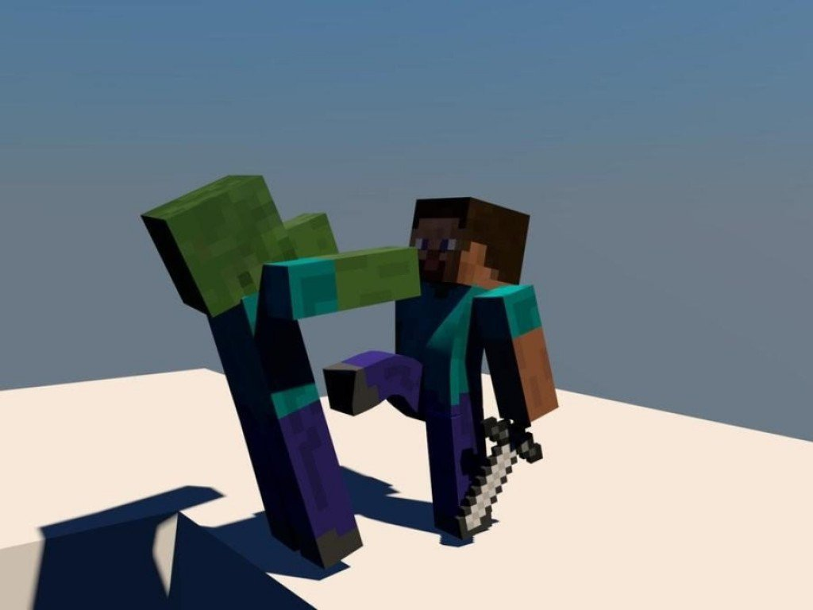

This Gladiator AI uses the Sarsa Model-Free Reinforcement algorithm to defeat Zombies!
Given enough time, love, and information, this AI will grow to be a fierce gladiator able to take on a variety of foes in life or death combat!

# Road Map
* [Complete] Create the arena and environment
* [Complete] Have Gladiator fight a single zombie
* [WIP] Have Gladiator fight multiple zombies
* [Incomplete] Vary the size of the environment

# Useful Links
[Gladiator GitHub Homepage](https://github.com/keiki83/Gladiator)

[Fighting Zombies in Minecraft With Deep Reinforcement Learning by Udagawa et al](http://cs229.stanford.edu/proj2016/report/UdagawaLeeNarasimhan-FightingZombiesInMinecraftWithDeepReinforcementLearning-report.pdf)
