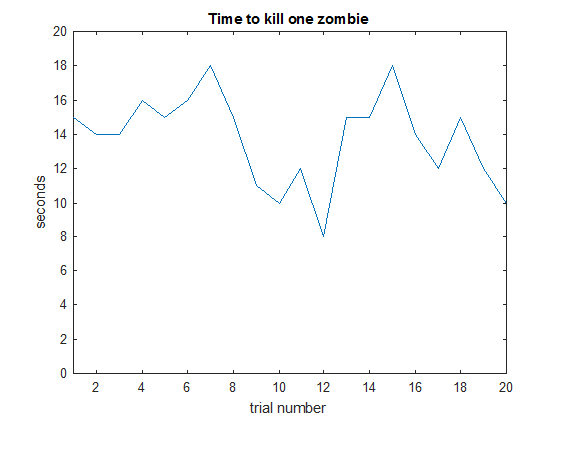
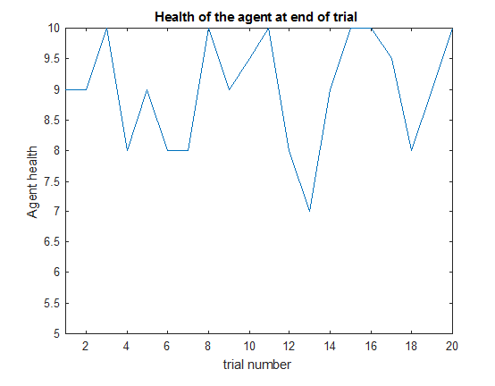

## Project Summary
<!--- things may have changed since proposal (even if they haven’t), write a short
paragraph summarizing the goals of the project (updated/improved version from the proposal). --->
The goal of Gladitor is to write an AI using the SARSA algorithm in order to fight against zombies and live. The AI will learn, via combat experience, to get the highest number of kills within a specified time window while staying alive. The input will be the terrain surrounding the AI, the position of the enemies, and the position and health of the agent. The output will be an action for the AI to take. We hope to create an AI that can survive if not overcome a variety of enemies.

## Approach
<!--- Give a detailed description of your approach, in a few paragraphs. You should summarize the
main algorithm you are using, such as by writing out the update equation (even if it is off-the-shelf). You
should also give details about the approach as it applies to your scenario. For example, if you are using
reinforcement learning for a given scenario, describe the MDP in detail, i.e. how many states/actions you
have, what does the reward function look like. A good guideline is to incorporate sufficient details so that
most of your approach is reproducible by a reader. I encourage you to use figures, as appropriate, for this,
as I provided in the writeup for the first assignment (available here: http://sameersingh.org/courses/
aiproj/sp17/assignments.html#assignment1). I recommend at least 2-3 paragraphs. --->
We are using the Sarsa Reinforcement Learning algorithm to guide you Malmo Agent. Every tick is 20ms and for every tick, the algorithm uses the Malmo API to get the local grid of blocks, the positions and health of the agent and nearby entities which make up the state space of the algorithm. The agent automatically looks at the nearest entity and always attacks to simplify the state space. Actions are chosen using an epsilon-greedy approach on the q-table, and the q-table is updated as such:

q_table[(s,a)] = q_lookup(q_table, s, a) + alpha * (reward + (gamma * q_lookup(q_table, s_prime, a_prime)) - q_lookup(q_table, s,a))

The state that is used as input for the algorithm is specifically: a list of immediately available blocks (air blocks), the health of the agent, and the coordinates of the closest entity. The agent only has five actions to choose: move north, move south, move west, move east and stand still. Rewards are calculated at the same time actions are issued. Negative rewards are given for injury and death with death having a steeper deduction. Positive rewards are given for enemy death and for being in close proximity to an enemy. There are also minor penalties for moving to discourage merely running, and penalties for bumping into walls to encourage smarter movement.

## Evaluation
<!--- An important aspect of your project, as we mentioned in the beginning, is evaluating your
project. Be clear and precise about describing the evaluation setup, for both quantitative and qualitative
results. Present the results to convince the reader that you have a working implementation. Use plots, charts,
tables, screenshots, figures, etc. as needed. I expect you will need at least a few paragraphs to describe each
type of evaluation that you perform. --->
There are two metrics that we are using to measure the effectiveness of our algorithm: the amount of kills the agent can get in a set time and the survivability.

For our base case, we measured the time it took to seek out and kill a single zombie and the amount of health the agent had at the end of the fight.

At the begininning of training, the time to kill a zombie remains fairly constant with it being the time the zombie takes to walk towards the agent and the agent tends to sustain a few hits. However after 10 or more runs, there are two interesting observation.
First, there are runs where the agent moves quickly towards the zombie killing it in as little as 8 seconds with some hits. Second, there are runs where the agent takes longer to kill the zombie but actually makes moves in the middle of the fight to come out with full health.

 

## Remaining Goals and Challenges
<!--- In a few paragraphs, describe your goals for the next 2-3 weeks, when
the final report is due. At the very least, describe how you consider your prototype to be limited, and what
you want to add to make it a complete contribution. Note that if you think your algorithm is quite good,
but have not performed sufficient evaluation, doing them can also be a reasonable goal. Similarly, you may
propose some baselines (such as a hand-coded policy) that you did not get a chance to implement, but
want to compare against for the final submission. Finally, given your experience so far, describe some of the
challenges you anticipate facing by the time your final report is due, how crippling you think it might be,
and what you might do to solve them. --->
The fact that the agent is knocked back when it is hit has created some difficulties with measuring the effectiveness of our algorithm as it affects the length of combat and the agents actions and is not consistent between trials. During tests, the algorithm was clearly learning to move towards the zombie quicker, but the time to kill the zombie remained similar to the inital training phases due to lucky hits for the zombie cause consecutive knockbacks before the agent could adjust its yaw.

The current goal is to add functionality to have the agent try to flee from combat if it believes it is not going to win the encounter. This would require adding the ability for it to determine a safe escape route while avoiding other Zombies. Afterwhich, it would determine when to re-engage in combat.

The prototype is limited because it not can not work in an environment without a flat floor. The AI can be improved by giving it the ability to be able to climb a single block which would allow it to navigate an environent more applicable to the default world of Minecraft. Block detection at height of the player would also be required so that it does not try to walk through a 1 block tall passageway.
